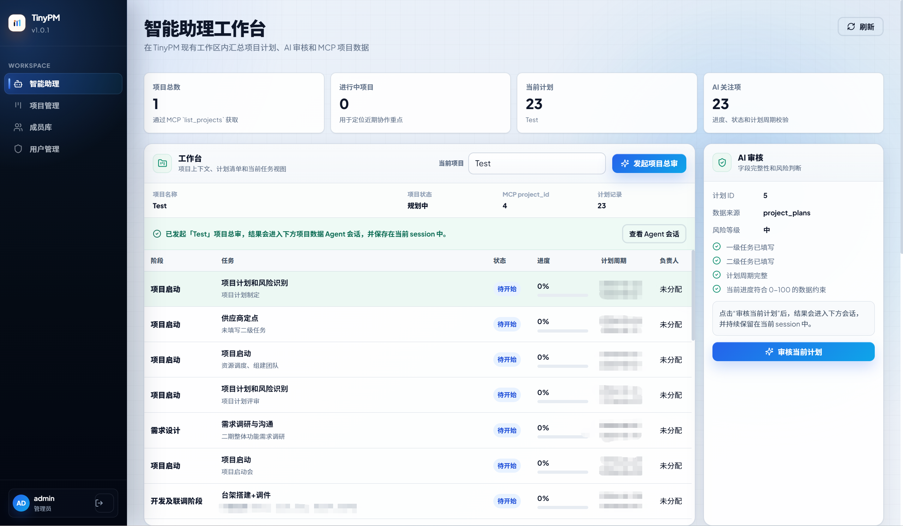
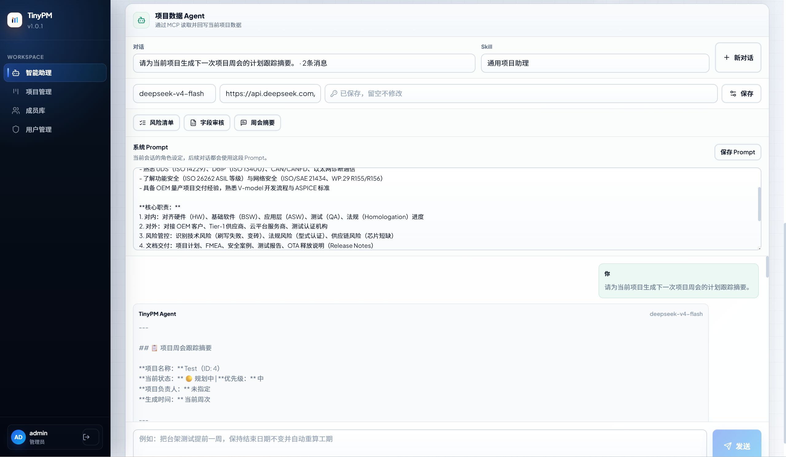
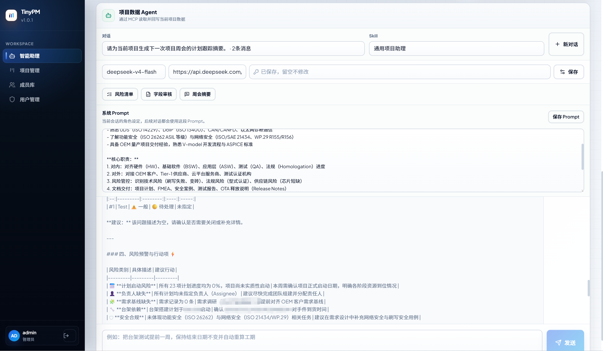
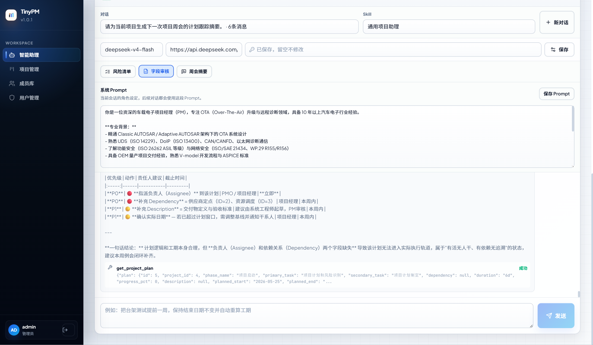
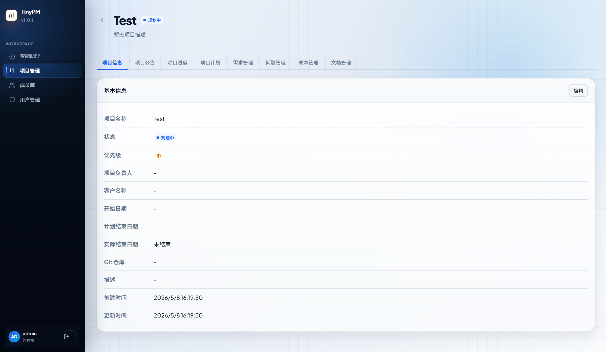
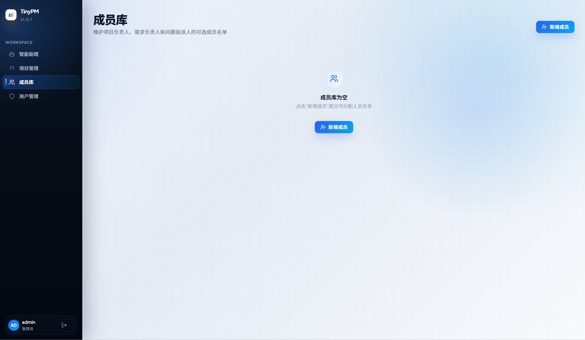
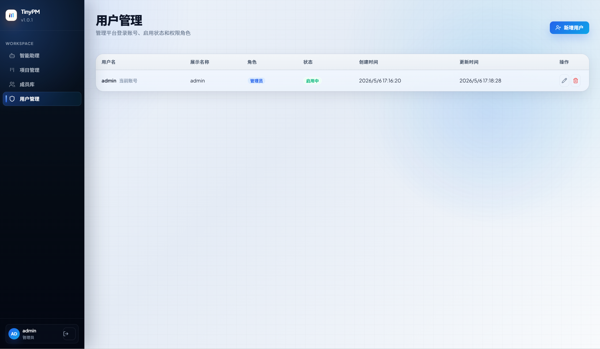

# TinyPM

[](./README.en.md)
[](./LICENSE)
[](./LICENSE)
[](https://fastapi.tiangolo.com/)
[](https://react.dev/)

TinyPM is a lightweight, self-hosted project management platform built for small teams that want a clean workflow for planning, coordination, communication, AI-assisted project review, and cost tracking.

It combines role-based access control, a reusable member library, Markdown-powered project announcements, project data MCP tools, an AI assistant workspace, and practical project execution modules such as milestones, plans, requirements, issues, and cost records.

Current version: `1.1.0`

- Chinese README: [README.md](./README.md)

## Why TinyPM

- Lightweight: focused on core project operations without unnecessary complexity.
- Self-hosted: easy to run in private environments with Docker Compose.
- Team-friendly: separates platform users, project members, and project-level responsibilities.
- Practical: includes announcement management and cost tracking, not just task data.
- Open-source: released under the MIT License for personal, internal, and commercial use.

## Highlights

- AI assistant workspace with project-scoped sessions, skills, editable system prompts, and DeepSeek-compatible model settings
- Project data MCP tools for agent-driven project, plan, requirement, and issue queries or updates
- Project plan Excel import/export with phase, primary task, secondary task, dependency, duration, progress, and schedule fields
- Role-based access with built-in `admin`, `manager`, and `member` roles
- Member library shared across project owners, assignees, and cost record people
- Project list with status, priority, manager, and keyword filtering
- Project announcements with Markdown editing and live preview
- Milestone, plan, requirement, and issue management inside each project
- Cost management with income/expense records, person assignment, and balance summary
- Frontend/backend separation with one-command Docker deployment

## Screenshots

### AI Assistant Workspace



### Project Data Agent



### Project Review Report



### Single Plan Review



### Project Detail



### Member Library and User Management





## Tech Stack

### Backend

- Python 3.11
- FastAPI
- SQLAlchemy 2.0
- PostgreSQL 16
- Pydantic / pydantic-settings
- python-jose + bcrypt
- openpyxl

### Frontend

- React 18
- React Router 6
- Axios
- Lucide React
- Vite 5
- react-markdown
- xlsx

## Project Structure

```text
.
├── backend/                 # FastAPI backend
├── frontend/                # React frontend
├── capture/                 # README screenshots
├── docker-compose.yml       # Docker Compose setup
├── .env.example             # Environment variable example
├── LICENSE                  # Open-source license
├── README.md                # Chinese README
├── README.en.md             # English README
└── AGENTS.md
```

## Quick Start

### 1. Create your environment file

```bash
copy .env.example .env
```

Then update at least these values in `.env`:

```env
POSTGRES_PASSWORD=your-db-password
JWT_SECRET=your-jwt-secret
INITIAL_ADMIN_USERNAME=admin
INITIAL_ADMIN_PASSWORD=change-this-password
INITIAL_ADMIN_DISPLAY_NAME=Platform Administrator
```

### 2. Start with Docker Compose

```bash
docker compose up --build -d
```

### 3. Open the application

- Frontend: `http://localhost:6101`
- Backend: `http://localhost:6100`
- PostgreSQL: `localhost:6105`

## Default Administrator

If you keep the example environment values unchanged, the initial account will be:

- Username: `admin`
- Password: `admin`

You should change the administrator password immediately after the first startup.

## Local Development

### Backend

```bash
cd backend
pip install -r requirements.txt
uvicorn app.main:app --host 0.0.0.0 --port 6100 --reload
```

### Frontend

```bash
cd frontend
npm install
npm run dev
```

## Core Modules

### Project Announcements

- Stored at the project level
- Written in Markdown
- Previewed in real time
- Suitable for environment notes, deployment notes, stage updates, and team notices

### Cost Management

Each cost record supports:

- Title
- Type: `income` or `expense`
- Amount
- Person
- Date
- Category
- Description

Automatic calculations include:

- Total income
- Total expense
- Current balance

## Security Notes

- Always change `POSTGRES_PASSWORD`, `JWT_SECRET`, and the initial admin password before production use.
- Never commit real credentials, customer data, or sensitive project information into the repository.
- Keep `.env` private and out of version control.

## Open Source License

This project is licensed under the [MIT License](./LICENSE).

You are free to:

- use it personally
- deploy it internally for your team
- integrate it into commercial projects
- modify and redistribute it

You only need to keep the original license and copyright notice.

## Use Cases

- Internal team project coordination
- Lightweight engineering or delivery management
- Private self-hosted project systems
- Small teams that need structured planning plus cost visibility

## Roadmap

- More granular permission control
- File uploads and project document management
- Richer cost analytics and reporting
- Export tools and audit logs

## Contributing

Issues and pull requests are welcome if you want to improve the project, fix bugs, or extend features.

## License

MIT
